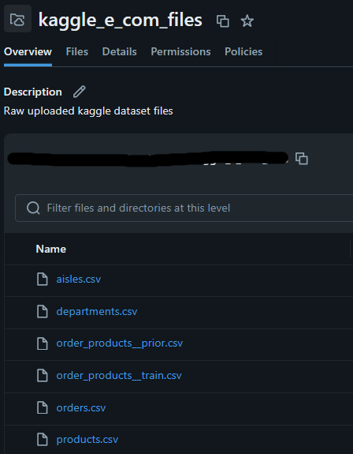
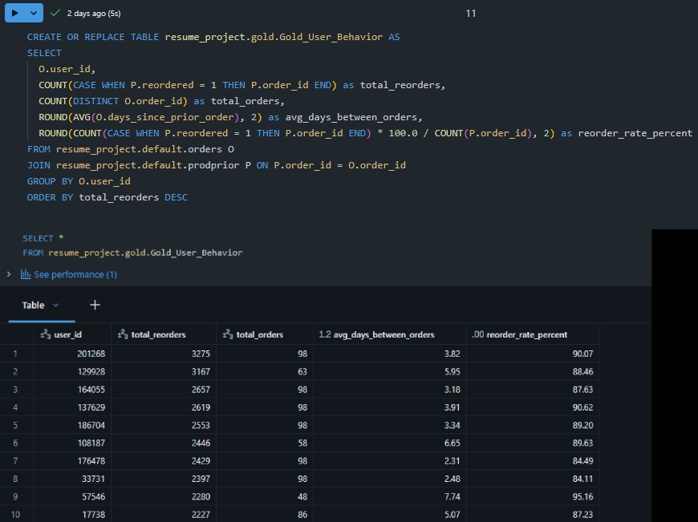
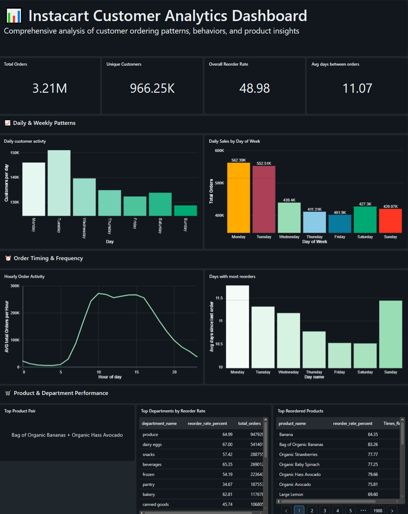
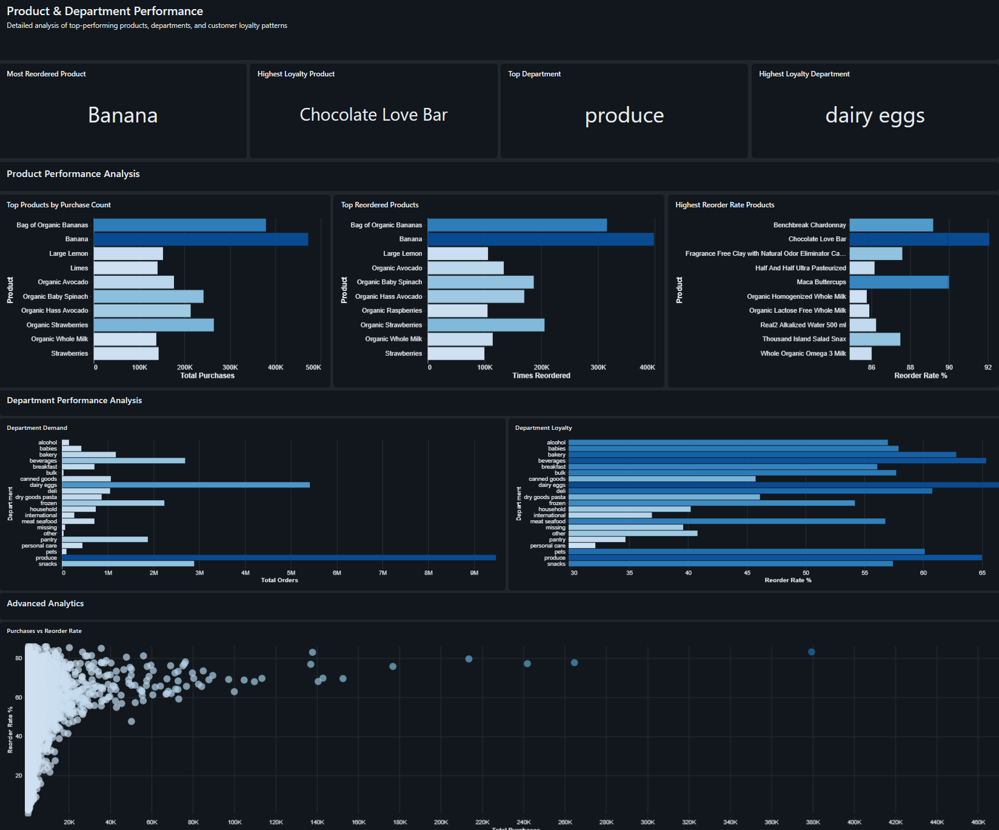
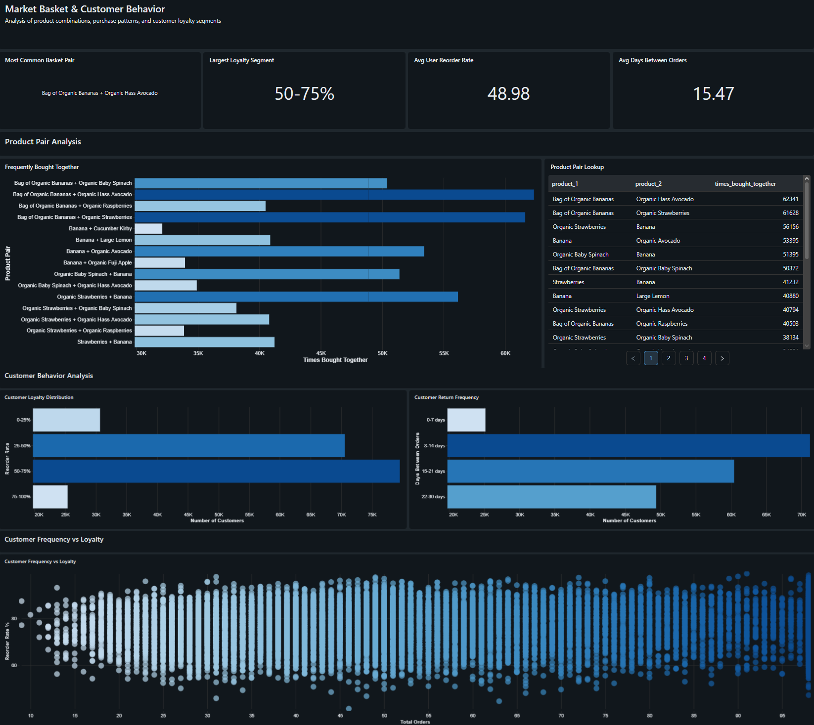

# Instacart Market Basket Lakehouse Pipeline

## Project Overview

This project builds a Databricks Lakehouse pipeline using the Instacart Market Basket Analysis dataset. The pipeline takes raw e-commerce order data, loads it into Bronze tables, cleans and prepares it into Silver tables, and creates Gold analytics tables used for dashboard reporting.

Because the Instacart dataset does not include product prices, revenue, payment values, or profit data, this project focuses on order activity, reorder behavior, customer loyalty, department trends, and frequently bought-together products instead of sales or revenue metrics.

## Business Problem

Instacart-style grocery platforms need to understand how customers shop, when they place orders, which products they reorder, which departments drive repeat behavior, and which products are commonly purchased together.

This project answers questions such as:

- What times of day have the most order activity?
- Which days of the week are busiest?
- Which products are reordered most often?
- Which departments have the strongest reorder behavior?
- Which users show high repeat-order behavior?
- Which products are frequently bought together?

## Dataset

The project uses the Instacart Market Basket Analysis dataset from Kaggle.

Main source files used:

- `orders.csv`
- `products.csv`
- `aisles.csv`
- `departments.csv`
- `order_products__prior.csv`
- `order_products__train.csv`

The dataset contains customer order history, product metadata, department metadata, aisle metadata, order timing fields, and reorder indicators.

The dataset does not include revenue, product price, payment, or profit columns.

## Tech Stack

- Databricks
- SQL
- PySpark / Spark SQL
- Delta Lake
- Python
- GitHub
- Dashboarding tool: Databricks SQL Dashboard / BI dashboard

## Architecture

The project follows a Bronze, Silver, and Gold Lakehouse structure.

```text
Raw Instacart CSV files
        ↓
Bronze tables
        ↓
Silver cleaned tables
        ↓
Gold analytics tables
        ↓
Dashboard pages
```

## Lakehouse Layers

### Bronze Layer

The Bronze layer stores raw Instacart source files with minimal transformation. These tables preserve the structure of the original CSV files and act as the ingestion layer for the pipeline.

Example Bronze tables:

- `bronze_orders`
- `bronze_products`
- `bronze_aisles`
- `bronze_departments`
- `bronze_order_products_prior`
- `bronze_order_products_train`

### Silver Layer

The Silver layer cleans and prepares the raw data for analytics. This includes selecting relevant columns, standardizing names, preparing order/product relationships, and creating usable tables for downstream Gold transformations.

Example Silver tables:

- `orders` - Cleaned order data with timing and customer information
- `products` - Product catalog with aisle and department mappings
- `aisles` - Aisle dimension table
- `departments` - Department dimension table
- `prodprior` - Prior order products (order-product relationships)
- `prodtrain` - Training set order products

### Gold Layer

The Gold layer contains business-ready analytics tables used directly by the dashboard. These tables answer specific business questions around ordering behavior, reorders, departments, users, and market basket analysis.

## Gold Tables

| Gold Table | Purpose | Main Question Answered |
|---|---|---|
| `gold_hourly_orders` | Tracks order activity by hour of day | What time of day do people order most? |
| `gold_daily_orders` | Tracks order activity by day of week | Which days of the week are busiest? |
| `gold_reorders` | Ranks products by reorder frequency | Which products are reordered the most? |
| `gold_departments` | Measures department order volume and reorder behavior | Which departments are most popular and reordered most? |
| `gold_user_behavior` | Analyzes customer loyalty and ordering patterns | Which users reorder often and how frequently do they order? |
| `gold_product_pairs` | Identifies products bought together | Which products are commonly purchased together? |

## Dashboard

The dashboard is built from the Gold analytics tables and contains three pages.

### Page 1: Overview

The Overview page summarizes general ordering behavior.

Example visuals:

- Total orders
- Unique customers
- Orders by day of week
- Orders by hour of day
- Average days since prior order
- Overall reorder behavior

### Page 2: Product & Department Performance

This page focuses on product and department-level reorder behavior.

Example visuals:

- Top reordered products
- Products with the highest reorder rates
- Department demand
- Department reorder behavior
- Product demand vs. reorder loyalty

### Page 3: Market Basket & Customer Behavior

This page focuses on product-pair relationships and customer repeat-order behavior.

Example visuals:

- Frequently bought-together product pairs
- Product pair lookup table
- Customer reorder rate behavior
- Average days between orders
- Customer frequency vs. loyalty

## Key Insights

The dashboard is designed to surface insights such as:

- Order activity changes by hour of day and day of week.
- Some products are purchased frequently, while others show stronger reorder loyalty.
- Department-level reorder rates help identify which categories drive repeat shopping behavior.
- Frequently bought-together product pairs can support recommendations, bundling, and basket analysis.
- User reorder behavior can help segment customers by repeat-order patterns.

## Project Structure

```text
instacart-lakehouse-pipeline/
│
├── README.md
├── requirements.txt
├── notebooks/
│   ├── 01_bronze_ingestion.py
│   ├── 02_silver_cleaning.py
│   ├── 03_gold_tables.py
│   └── 04_dashboard_queries.py
│
├── sql/
│   ├── gold_hourly_orders.sql
│   ├── gold_daily_orders.sql
│   ├── gold_reorders.sql
│   ├── gold_departments.sql
│   ├── gold_user_behavior.sql
│   └── gold_product_pairs.sql
│
├── docs/
│   ├── architecture.md
│   ├── table_design.md
│   └── data_dictionary.md
│
├── screenshots/
│   ├── 01_raw_files_volume.png
│   ├── 02_bronze_tables_catalog.png
│   ├── 03_silver_tables_catalog.png
│   ├── 04_gold_tables_catalog.png
│   ├── 05_successful_gold_table_run.png
│   ├── 06_dashboard_overview_top.png
│   ├── 07_dashboard_overview_charts.png
│   ├── 08_dashboard_product_department_top.png
│   ├── 09_dashboard_product_department_charts.png
│   ├── 10_dashboard_market_basket_top.png
│   └── 11_dashboard_market_basket_charts.png
│
└── dashboard/
```

## How to Run

1. **Download Dataset**: Download the [Instacart Market Basket Analysis dataset from Kaggle](https://www.kaggle.com/c/instacart-market-basket-analysis)

2. **Upload to Databricks Volume**:
   * Create a Unity Catalog volume at `/Volumes/resume_project/default/kaggle_e_com_files/`
   * Upload the CSV files (aisles.csv, departments.csv, orders.csv, products.csv, order_products__prior.csv, order_products__train.csv)

3. **Run Notebooks in Order**:
   * **Kaggle Ecommerce Bronze Layer Ingestion** - Creates bronze tables from CSV files
   * **Kaggle Ecommerce Silver Layer Transformation** - Cleans and validates data, creates silver tables
   * **Kaggle Ecommerce Gold Layer** - Creates analytics-ready gold tables

4. **Verify Tables**:
   * Check `resume_project.default` schema for bronze and silver tables
   * Check `resume_project.gold` schema for gold analytics tables

5. **Connect Dashboard**:
   * Open the **Instacart Customer Analytics** dashboard
   * Connect to the gold tables for visualization

6. **Review Insights**: Explore order patterns, product reorder behavior, department performance, and customer loyalty metrics

## Screenshots

### Raw Files in Databricks Volume



### Gold Tables in Catalog Explorer


### Dashboard Overview


### Product & Department Performance


### Market Basket & Customer Behavior


## Future Improvements

* **Automated Scheduling**: Add Databricks Jobs to schedule bronze → silver → gold pipeline runs
* **Enhanced Data Quality**: Expand validation rules and add data quality metrics tracking
* **Orchestration**: Implement Databricks Workflows or Apache Airflow for complex pipeline dependencies
* **Recommendation Engine**: Build a recommendation scoring layer using product-pair frequency and collaborative filtering
* **Advanced Segmentation**: Add RFM (Recency, Frequency, Monetary) analysis and customer clustering
* **CI/CD Pipeline**: Add GitHub Actions for SQL validation, linting, and automated testing
* **Performance Optimization**: Add partition strategies and Z-ordering for large-scale data
* **Incremental Loads**: Convert full-refresh tables to incremental processing with Delta Lake merge operations

## Resume Summary

This project demonstrates a complete data engineering workflow using Databricks, SQL, PySpark, Delta Lake, and dashboarding. It transforms raw Instacart e-commerce data into analytics-ready Gold tables for market basket analysis, reorder behavior, department trends, and customer loyalty insights.
